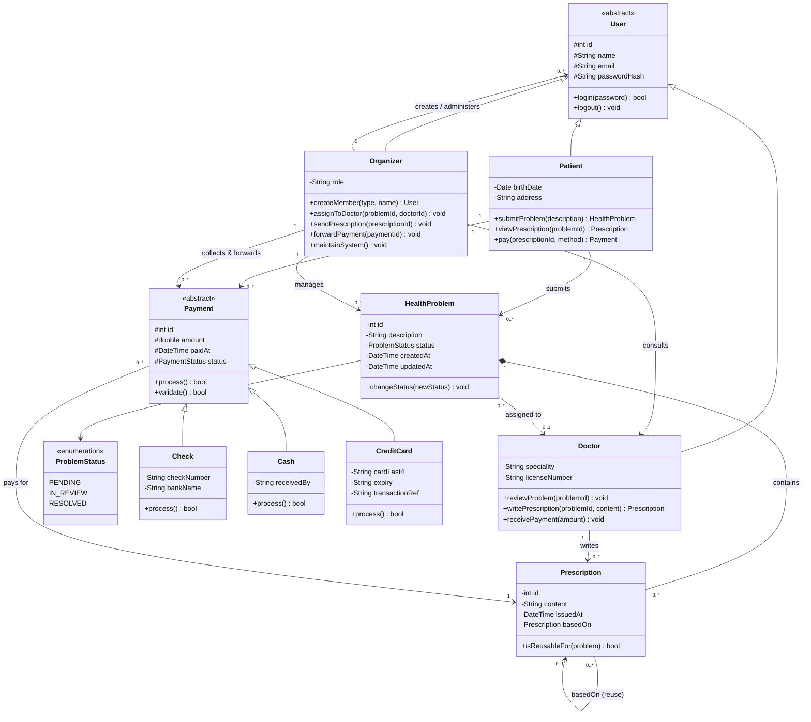

# Class Diagram

```mermaid
classDiagram
    direction TB

    class User {
        <<abstract>>
        #int id
        #String name
        #String email
        #String passwordHash
        +login(password) bool
        +logout() void
    }

    class Patient {
        -Date birthDate
        -String address
        +submitProblem(description) HealthProblem
        +viewPrescription(problemId) Prescription
        +pay(prescriptionId, method) Payment
    }

    class Doctor {
        -String speciality
        -String licenseNumber
        +reviewProblem(problemId) void
        +writePrescription(problemId, content) Prescription
        +receivePayment(amount) void
    }

    class Organizer {
        -String role
        +createMember(type, name) User
        +assignToDoctor(problemId, doctorId) void
        +sendPrescription(prescriptionId) void
        +forwardPayment(paymentId) void
        +maintainSystem() void
    }

    class HealthProblem {
        -int id
        -String description
        -ProblemStatus status
        -DateTime createdAt
        -DateTime updatedAt
        +changeStatus(newStatus) void
    }

    class ProblemStatus {
        <<enumeration>>
        PENDING
        IN_REVIEW
        RESOLVED
    }

    class Prescription {
        -int id
        -String content
        -DateTime issuedAt
        -Prescription basedOn
        +isReusableFor(problem) bool
    }

    class Payment {
        <<abstract>>
        #int id
        #double amount
        #DateTime paidAt
        #PaymentStatus status
        +process() bool
        +validate() bool
    }

    class Check {
        -String checkNumber
        -String bankName
        +process() bool
    }

    class Cash {
        -String receivedBy
        +process() bool
    }

    class CreditCard {
        -String cardLast4
        -String expiry
        -String transactionRef
        +process() bool
    }

    User <|-- Patient
    User <|-- Doctor
    User <|-- Organizer

    Payment <|-- Check
    Payment <|-- Cash
    Payment <|-- CreditCard

    Patient "1" --> "0..*" HealthProblem : submits
    Organizer "1" --> "0..*" HealthProblem : manages
    Organizer "1" --> "1..*" Doctor : consults
    Organizer "1" --> "0..*" User : creates / administers
    HealthProblem "0..*" --> "0..1" Doctor : assigned to
    HealthProblem --> ProblemStatus
    HealthProblem "1" *-- "0..*" Prescription : contains
    Doctor "1" --> "0..*" Prescription : writes
    Prescription "0..*" --> "0..1" Prescription : basedOn (reuse)
    Payment "0..*" --> "1" Prescription : pays for
    Patient "1" --> "0..*" Payment : makes
    Organizer "1" --> "0..*" Payment : collects & forwards
```
