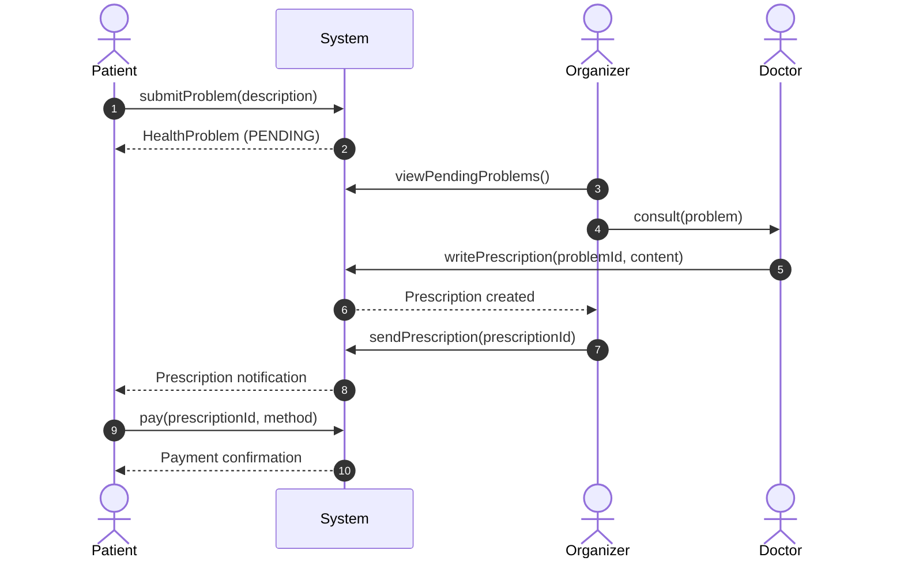
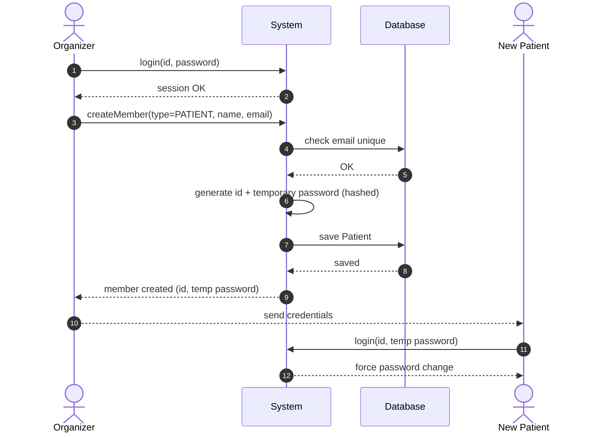
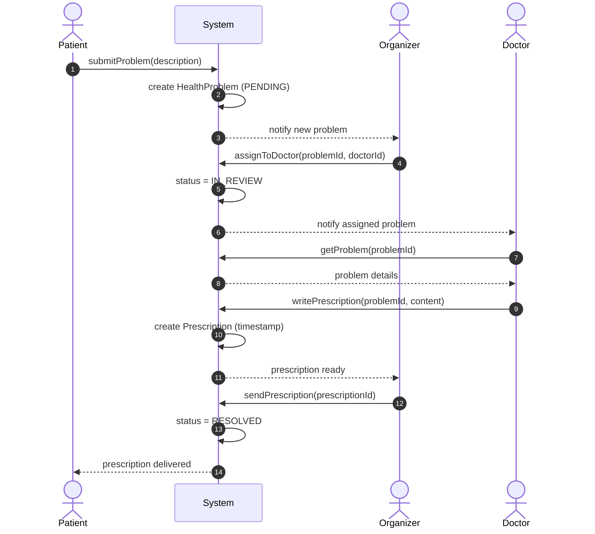
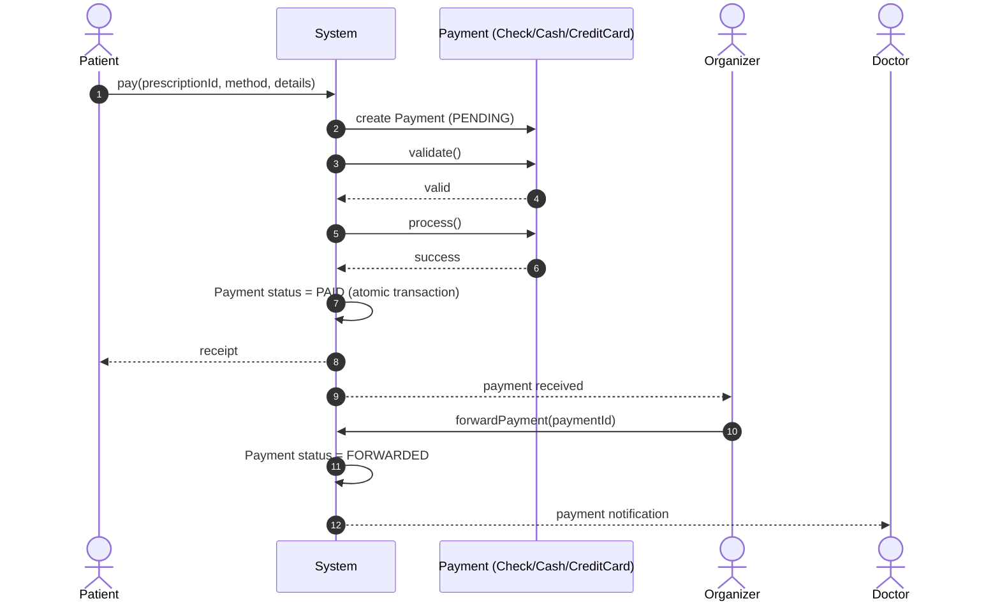

# Sequence Diagrams

## 1. Basic scenario: submit, prescription, pay

```mermaid
sequenceDiagram
    autonumber
    actor P as Patient
    participant S as System
    actor O as Organizer
    actor D as Doctor

    P->>S: submitProblem(description)
    S-->>P: HealthProblem (PENDING)
    O->>S: viewPendingProblems()
    O->>D: consult(problem)
    D->>S: writePrescription(problemId, content)
    S-->>O: Prescription created
    O->>S: sendPrescription(prescriptionId)
    S-->>P: Prescription notification
    P->>S: pay(prescriptionId, method)
    S-->>P: Payment confirmation
```

## 2. Patient registration (Organizer creates member)

```mermaid
sequenceDiagram
    autonumber
    actor O as Organizer
    participant S as System
    participant DB as Database
    actor P as New Patient

    O->>S: login(id, password)
    S-->>O: session OK
    O->>S: createMember(type=PATIENT, name, email)
    S->>DB: check email unique
    DB-->>S: OK
    S->>S: generate id + temporary password (hashed)
    S->>DB: save Patient
    DB-->>S: saved
    S-->>O: member created (id, temp password)
    O-->>P: send credentials
    P->>S: login(id, temp password)
    S-->>P: force password change
```

## 3. Consultation flow

```mermaid
sequenceDiagram
    autonumber
    actor P as Patient
    participant S as System
    actor O as Organizer
    actor D as Doctor

    P->>S: submitProblem(description)
    S->>S: create HealthProblem (PENDING)
    S-->>O: notify new problem
    O->>S: assignToDoctor(problemId, doctorId)
    S->>S: status = IN_REVIEW
    S-->>D: notify assigned problem
    D->>S: getProblem(problemId)
    S-->>D: problem details
    D->>S: writePrescription(problemId, content)
    S->>S: create Prescription (timestamp)
    S-->>O: prescription ready
    O->>S: sendPrescription(prescriptionId)
    S->>S: status = RESOLVED
    S-->>P: prescription delivered
```

## 4. Payment processing

```mermaid
sequenceDiagram
    autonumber
    actor P as Patient
    participant S as System
    participant PM as Payment (Check/Cash/CreditCard)
    actor O as Organizer
    actor D as Doctor

    P->>S: pay(prescriptionId, method, details)
    S->>PM: create Payment (PENDING)
    S->>PM: validate()
    PM-->>S: valid
    S->>PM: process()
    PM-->>S: success
    S->>S: Payment status = PAID (atomic transaction)
    S-->>P: receipt
    S-->>O: payment received
    O->>S: forwardPayment(paymentId)
    S->>S: Payment status = FORWARDED
    S-->>D: payment notification
```
